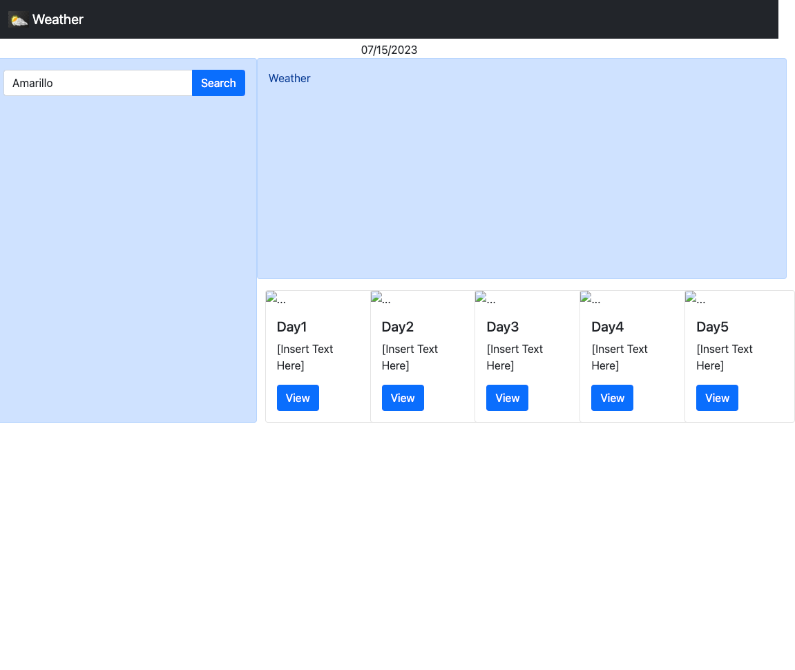

# weather-dashboard

## Description

This is a web application used to show the user the a detailed current weather report based on location from api.openweathermap.org, and a 5 day weather forecast. The web app will also allow the user to view previous search history.

**This web application is currently in development**

## Installation

N/A

## Usage

When the user enters a location in the search area, the 3rd Party API from https://api.openweathermap.org will use the user input to generate the location specified. The API will return information regarding the current forecast, and a 5 day weather forecast. The area below the search button will display previous searches to enhance the user experience and allow the user to navigate the web app quickly.

## Screenshot

## Links

https://zbichsel.github.io/weather-dashboard

https://www.github.com/zbichsel/weather-dashboard

## Credits

N/A

## Contact Me

If you have any questions, please contact me at: biksel09@gmail.com

## License

Please refer to the LICENSE in the repository.